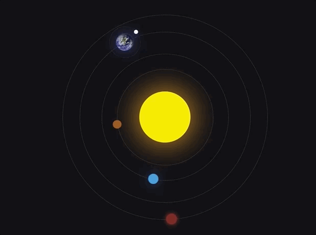
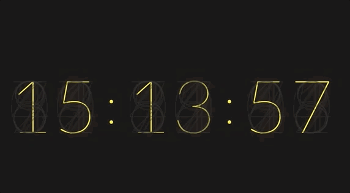
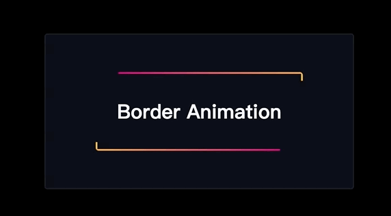

# CSS-MAGIC
持续更新各种css交互实现，用CSS带你领略世界的美

## 效果展示
### 3D导航栏
应用到的知识点：   
- HTML 实体编码
- transform: skewY用法
- content: attr(data-icon)用法
- CSS 自定义属性用法
  

### 太阳系系统

### 圣诞树

### 交互灯

### 数字时钟

### 图像滑块

### 边框动画

### 新年倒计时

### 浮动标签

### 魔幻导航菜单

### 牛顿摆Loading
